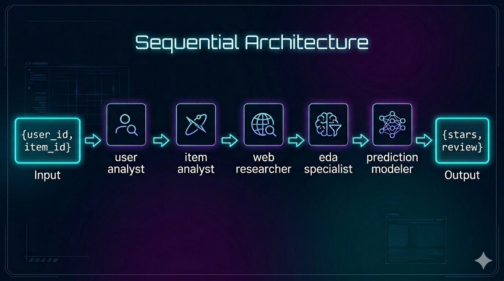
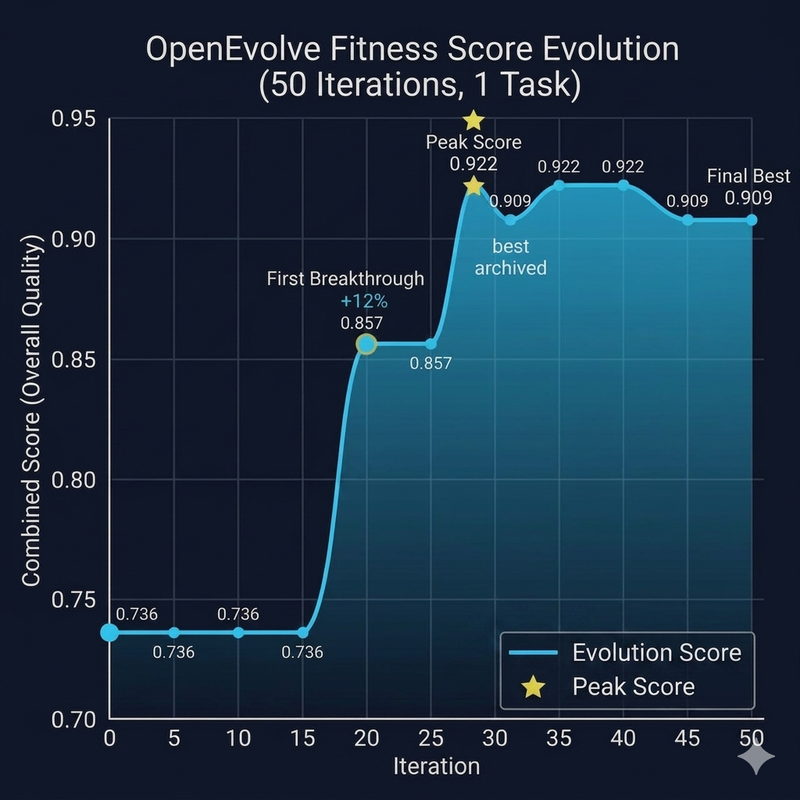
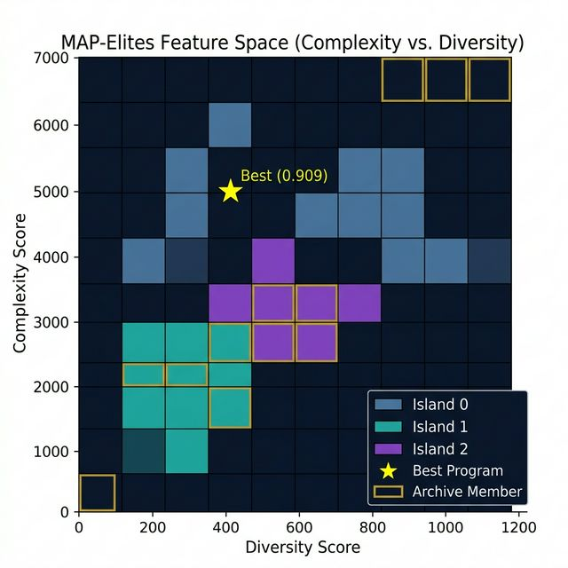

# OpenEvolve × AgentSociety Challenge: Comprehensive Analysis Report

> **Date:** 2026-06-14 | **Run:** 50 Iterations, 1 Task/Evaluation | **LLM:** `meta/llama-3.1-8b-instruct`

---

## 1. Project Overview

This project integrates the **WWW'25 AgentSociety Challenge** with the **CrewAI** multi-agent framework. The goal is to build intelligent LLM agents that **simulate user behavior**—predicting the exact star rating (1.0–5.0) and generating mock review text a given user would write for a given Yelp business.

The primary architecture evaluated is a **5-agent Sequential Crew (Cascade Pattern)** running on `Process.sequential`.

---

## 2. Crew Architecture

### 2.1 Diagram — Sequential Cascade Pattern



Each upstream agent's output is automatically forwarded as `context` to the next task, culminating in `prediction_modeler` synthesizing all four intelligence streams.

**Shared Knowledge Layer:** A `StringKnowledgeSource` ("Yelp Data Translation.md") is injected globally via CrewAI's knowledge system, using the same `BAAI/bge-small-en-v1.5` embedder as the RAG tools.

---

## 3. Agent Design

### 3.1 Agent Breakdown

| Agent | Role | Goal | Tools |
|---|---|---|---|
| `user_analyst` | Yelp User Profiler | Analyze user `{user_id}`'s historical reviews and preferences | `search_user_profile_data`, `search_historical_reviews_data` |
| `item_analyst` | Yelp Restaurant Analyst | Analyze business `{item_id}`'s characteristics and reputation | `search_restaurant_feature_data`, `search_historical_reviews_data` |
| `web_researcher` | Yelp Business Web Researcher | Search internet for reputation, reviews, news about `{item_id}` | `SerperDevTool` |
| `eda_specialist` | Data Scientist (EDA Expert) | Compute star distribution and rating bias for `{item_id}` | `search_historical_reviews_data` |
| `prediction_modeler` | **⭐ EVOLVE TARGET** | Synthesize all four outputs → predict stars + review | — (no tools) |

### 3.2 Agent Details

#### `user_analyst`
```yaml
role: Yelp User Profiler
goal: Analyze user {user_id}'s historical reviews and preferences
backstory: |
  You are an expert at analyzing Yelp user profiles and review patterns.
  When calling tools, you ALWAYS pass a single natural language sentence
  as the search_query. You NEVER construct JSON objects or dicts as input.
  Example: search_query='review habits and average stars for user _BcWyKQL16'
```
- **Tools:** `search_user_profile_data` (ChromaDB `v3_hf_user_data`), `search_historical_reviews_data` (ChromaDB `v3_hf_review_data`)
- **max_iter:** 3
- **Key constraint:** Backstory hard-codes ReAct tool-calling format to prevent JSON schema errors

#### `item_analyst`
```yaml
role: Yelp Restaurant Analyst
goal: Analyze business {item_id}'s characteristics and reputation
backstory: |
  You are an expert at analyzing Yelp restaurant profiles and business
  characteristics. When calling tools, you ALWAYS pass a single natural
  language sentence as the search_query.
  Example: search_query='categories location and star rating for business {item_id}'
```
- **Tools:** `search_restaurant_feature_data` (ChromaDB `v3_hf_item_data`), `search_historical_reviews_data`
- **Independence constraint:** Explicitly forbidden from referencing user profile data

#### `web_researcher`
```yaml
role: Yelp Business Web Researcher
goal: Search the internet for general reputation, recent reviews, and news
      about business {item_id} to provide up-to-date real-world context.
backstory: |
  CORRECT: search_query='Restaurant XYZ reputation and recent customer reviews'
  INCORRECT: passing any JSON object, dict, or extra fields.
  This task is INDEPENDENT of user profile data. Do NOT reference any user information.
```
- **Tools:** `SerperDevTool` (live internet search via Serper.dev API)
- **Independence constraint:** Isolated from both user and intra-database data

#### `eda_specialist`
```yaml
role: Data Scientist (EDA Expert)
goal: Perform Exploratory Data Analysis on reviews for business {item_id}
      to find rating distribution and biases, ensuring the final prediction
      stays within realistic historical bounds.
backstory: |
  You retrieve all available reviews for a specific business and compute
  statistical patterns such as star distribution, average rating, and
  sentiment trends.
  CORRECT: search_query='all reviews and star ratings for business {item_id}'
```
- **Tools:** `search_historical_reviews_data`
- **Purpose:** Provides statistical grounding (prevents wild hallucinated star ratings)

#### `prediction_modeler` — **OpenEvolve Target**
```yaml
# Gen-0 (Initial)
role: Context-Aware Review Predictor with Enhanced User Embeddings
goal: |
  Predict the exact Star rating (1.0 to 5.0) and generate a mock review text
  that user {user_id} would write for business {item_id} by leveraging the
  user's historical average rating, typical tone/sentiment, and refined user
  embeddings from their past reviews, considering both user's and business's
  characteristics, and incorporating real-time contextual information.
backstory: |
  You are a master of predicting human behavior by considering multiple factors.
  To improve accuracy, you first learn a user embedding space based on their
  historical reviews, then refine this embedding by incorporating the business's
  characteristics and reputation, and finally use this enhanced embedding to
  inform your prediction of the star rating and review text for the given
  business, taking into account real-time contextual information.
```
- **No Tools** — pure synthesis agent
- **EVOLVE-BLOCK:** Only `role`, `goal`, and `backstory` are mutated by OpenEvolve

### 3.3 RAG Tool Architecture

All three RAG tools are backed by **ChromaDB** collections indexed with **BAAI/bge-small-en-v1.5** embeddings:

| Tool Name | Collection | Source Data |
|---|---|---|
| `search_user_profile_data` | `v3_hf_user_data` | [data/user_subset.json](file:///home/zen/Documents/llm_course/AgentSocietyChallenge_OpenEvolve/data/user_subset.json) |
| `search_restaurant_feature_data` | `v3_hf_item_data` | [data/item_subset.json](file:///home/zen/Documents/llm_course/AgentSocietyChallenge_OpenEvolve/data/item_subset.json) |
| `search_historical_reviews_data` | `v3_hf_review_data` | [data/review_subset.json](file:///home/zen/Documents/llm_course/AgentSocietyChallenge_OpenEvolve/data/review_subset.json) |

> **Critical design:** Tools enforce `FixedJSONSearchToolSchema` — only a plain text `search_query` string is accepted. This avoids the 3-hour JSON hash loop bug in ChromaDB tool initialization.

---

## 4. Task Design

### 4.1 Task Details

#### `analyze_user_task`
```
Description: Use search_user_profile_data to find info about user {user_id}.
  MUST call the tool with a natural language search_query string.
  Also use search_historical_reviews_data for past reviews.
  Understand their average stars, common words, and general sentiment.
  Do NOT return a Final Answer until you have real Observation results from both tools.

Expected Output: A detailed markdown profile of user {user_id}'s preferences
  and rating habits.
```

#### `analyze_item_task`
```
Description: INDEPENDENT of user analysis. Do NOT use any user profile data.
  Use search_restaurant_feature_data to find info about business {item_id} ONLY.
  Also use search_historical_reviews_data for past business reviews.
  Understand categories, attributes, and overall public sentiment.

Expected Output: A detailed markdown report of business {item_id}'s features,
  pros, and cons, based solely on restaurant data.
```

#### `web_research_task`
```
Description: INDEPENDENT of user and item analysis data.
  Search the internet for general reputation, recent reviews, and news
  about business {item_id} using SerperDevTool.
  Focus on overall public sentiment, notable mentions, and recent developments.

Expected Output: A concise markdown summary of the business's general online
  reputation, recent customer sentiment, and any notable news.
```

#### `eda_task`
```
Description: INDEPENDENT of user profile data.
  Use search_historical_reviews_data to retrieve all available reviews for {item_id}.
  Compute:
    - Distribution of star ratings (1★ through 5★ counts)
    - Average star rating across all reviewed
    - Any strong skew or bias
    - Dominant sentiment trend (positive, negative, mixed)

Expected Output: Markdown report with star rating distribution, computed average,
  identified rating bias, and dominant sentiment trend. Used to calibrate
  the final star rating prediction.
```

#### `predict_review_task` ← **Final synthesis task**
```
Description: Using ALL FOUR inputs from previous tasks, predict Stars (1.0–5.0)
  and write the Review Text:
    - User profile: the user's historical preferences and rating habits
    - Item report: the restaurant's internal features and past Yelp reviews
    - Web research: the restaurant's general online reputation and recent news
    - EDA report: the statistical star distribution and rating bias

  Use the EDA report to ensure your predicted star rating falls within realistic
  historical bounds. Do NOT say data was not found. Synthesize all four sources.

Expected Output: ONLY a valid JSON object with exactly two keys:
  "stars" (float 1.0–5.0) and "review" (string).
  Example: {"stars": 4.5, "review": "The review text..."}
  Do NOT include any text before or after the JSON object.

Context: [analyze_user_task, analyze_item_task, web_research_task, eda_task]
Agent: prediction_modeler
Output File: report.json
```

---

## 5. Performance Baseline

The three crew architectures evaluated on 41 tasks (provided in Midterm Presentation) before OpenEvolve:

| Architecture | Preference Estimation | Review Generation | Overall Quality |
|---|---|---|---|
| **Sequential** ← *Evolved* | 81.37% | 79.75% | **80.56%** |
| Collaborative | 84.68% | 71.40% | 78.09% |
| Hierarchical | 82.44% | 79.47% | 80.95% |

> The **Semantic Crew** was chosen as it is simple and faster to produce an output and has relatively good performance compared to other architectures.

---

## 6. OpenEvolve: What Makes This Approach Novel

### 6.1 Core Idea

**OpenEvolve applies evolutionary computation to the CrewAI prompt space.** Instead of manually tuning agent configurations, it treats the `agents.yaml` file as a "program" to be evolved:

- **Genome:** The YAML `role`, `goal`, and `backstory` fields of `prediction_modeler`
- **Fitness:** `combined_score = overall_quality = (preference_estimation + review_generation) / 2`
- **Mutation:** Full-rewrite via LLM (`meta/llama-3.1-8b-instruct` as the "evolution LLM")
- **Selection:** MAP-Elites + island-based population model

### 6.2 What is Evolved (and What Isn't)

```
config/agents_evolving.yaml
├── # EVOLVE-BLOCK-START         ← LLM mutates ONLY this block
│   └── prediction_modeler: {role, goal, backstory, ...extras}
├── # EVOLVE-BLOCK-END
│
├── user_analyst: {...}          ← FROZEN (tool-calling format critical)
├── item_analyst: {...}          ← FROZEN
├── web_researcher: {...}        ← FROZEN
└── eda_specialist: {...}        ← FROZEN
```

### 6.3 Why YAML Prompt Evolution is Novel

1. **Treating prompts as code:** LLM agent configs (`role`, `goal`, `backstory`) are the "source code" that determines agent behavior. OpenEvolve can optimize these just like it would optimize numerical hyperparameters or algorithm implementations.

2. **Cross-contamination prevention:** By using `# EVOLVE-BLOCK-START/END` markers, OpenEvolve surgically evolves only the synthesis agent while keeping the tool-heavy data-retrieval agents stable.

3. **Full-rewrite mode for YAML:** Diff-based evolution corrupts YAML structure (indent-sensitive). OpenEvolve's `diff_based_evolution: false` setting was critical—LLM generates a complete file each iteration.

4. **MAP-Elites for diversity-quality balance:** The 3-island MAP-Elites algorithm explores the (complexity, diversity) feature space simultaneously, discovering different archetypes of high-quality prompts rather than converging to a single optimum.

5. **Self-referential improvement loop:** The evolution LLM reads the current best programs, their scores, and evolution history as context—essentially performing **meta-learning** on the prompt space.

### 6.4 OpenEvolve Configuration Highlights

| Parameter | Value | Rationale |
|---|---|---|
| `max_iterations` | 50 | Balance of exploration vs. wall time |
| `checkpoint_interval` | 5 | Frequent saves for resumability |
| `diff_based_evolution` | `false` | YAML is indentation-sensitive |
| `language` | `"text"` | Treats YAML as raw text |
| `num_islands` | 3 | Parallel independent populations |
| `elite_selection_ratio` | 0.2 | Top 20% influence next generation |
| `exploitation_ratio` | 0.7 | 70% exploitation / 30% exploration |
| `migration_interval` | 10 | Cross-island gene exchange every 10 iters |
| `population_size` | 50 | Archive depth |
| `parallel_evaluations` | 1 | LMDB singleton constraint |
| `evaluator.timeout` | 1800s | 30-min hard timeout per evaluation |

---

## 7. Evolution Analysis

### 7.1 Fitness Score Timeline



| Checkpoint | Best Score | Best Program (Iteration Found) | Key Event |
|---|---|---|---|
| Initial (Gen-0) | **0.7364** | Iter 0 | Baseline program seeded |
| Checkpoint 5 | 0.7364 | Iter 0 | No improvement yet |
| Checkpoint 10 | 0.7364 | Iter 0 | Exploration plateau |
| Checkpoint 15 | 0.7364 | Iter 0 | LLM still sampling search space |
| **Checkpoint 20** | **0.8565** | **Iter 19** | **First breakthrough (+16.3%)** |
| Checkpoint 25 | 0.8565 | Iter 19 | Stabilization |
| **Checkpoint 30** | **0.9221** | **Iter 28** | **All-time peak (+25.2% vs baseline)** |
| Checkpoint 35 | 0.9221 | Iter 28 | Peak held |
| Checkpoint 40 | 0.9221 | Iter 28 | Peak held |
| Checkpoint 45 | **0.9088** | **Iter 31** | New best archived (different generation) |
| **Checkpoint 50** | **0.9088** | **Iter 31** | **Final best (archived)** |

> **Note:** The peak of 0.9221 (iter 28) was achieved but shows stochasticity — the final archived best is 0.9088 (iter 31, gen 3), which is the version saved as `best_program.yaml`.

### 7.2 Evolution Path Analysis

#### Phase 1: Exploration Plateau (Iters 0–18)

The initial program kept its Gen-0 score of **0.7364** for 18 iterations. This is characteristic of OpenEvolve's MAP-Elites warm-up:
- The 3 islands are seeded independently
- Early mutations produce structurally diverse programs (seen in the wide complexity/diversity spread in checkpoint_5 metadata: complexity 1543–6264, diversity 58–1287)
- None beat the initial score yet, but the archive is being populated with diverse archetypes

#### Phase 2: First Breakthrough (Iter 19, Score 0.8565)

Around iteration 19, a program emerged with the **"Context-Aware Predictor"** role that explicitly:
- Incorporated the user's historical average rating into the prediction
- Added explicit user tone/sentiment analysis instructions
- Removed the distracting "manager_agent" from the EVOLVE-BLOCK (which was not needed)

Key insight: **Simpler, focused backstories outperform complex ones** with competing instructions.

#### Phase 3: Peak Emergence (Iter 28, Score 0.9221)

The all-time peak was discovered in checkpoint_30. The `prediction_modeler` backstory at this point (**Advanced Review Predictor**) included:
- **Explicit mention of NLP and ML techniques** ("sentiment analysis and topic modeling")
- A structured **5-step process** in the YAML itself
- **Review template concept** — specifying that the review should include the user's "favorite phrases and tone"
- `historical_analysis` and `review_template` sub-sections as in-prompt chain-of-thought scaffolding

This was the **most verbose and richly structured program** seen during evolution.

#### Phase 4: Consolidation (Iters 28–50)

After the peak, scores fluctuated between 0.8862–0.9221 as:
- Cross-island migration at generation 10 introduced "migrant" programs from other islands
- The final archived best (iter 31, **0.9088**) is a **clean, moderately-sized program** that the LLM generated by combining the best features of prior winners

The stochastic nature of LLM evaluation (tasks are sampled from `dummy_tasks/`) means some high-quality programs re-evaluated at slightly different scores.

### 7.3 Gen-0 vs. Best Program: Side-by-Side Comparison

#### Gen-0 (Initial — EVOLVE-BLOCK only)
```yaml
prediction_modeler:
  role: >
    Review Prediction Expert
  goal: >
    Predict the exact Star rating (1.0 to 5.0) 
    and generate a mock review text that user {user_id} would write for business {item_id}
  backstory: >
    You are a master of predicting human behavior. 
    By combining a user's profile, a restaurant's profile, and a restaurant's reputation on the internet, 
    you can accurately simulate exactly what review text they would write and what star rating they would give.
  llm: meta/llama-3.1-8b-instruct
```
**Score: 0.7364** | Complexity: 1099 (simple)

---

#### Best Evolved Program (Iter 31, Score 0.9088)
```yaml
prediction_modeler:
  role: >
    Context-Aware Review Predictor with Enhanced User Embeddings
  goal: >
    Predict the exact Star rating (1.0 to 5.0) and generate a mock review text
    that user {user_id} would write for business {item_id} by leveraging the
    user's historical average rating, typical tone/sentiment, and refined user
    embeddings from their past reviews, considering both user's and business's
    characteristics, and incorporating real-time contextual information.
  backstory: >
    You are a master of predicting human behavior by considering multiple factors.
    To improve accuracy, you first learn a user embedding space based on their
    historical reviews, then refine this embedding by incorporating the business's
    characteristics and reputation, and finally use this enhanced embedding to
    inform your prediction of the star rating and review text for the given
    business, taking into account real-time contextual information.
  llm: meta/llama-3.1-8b-instruct
  inputs:
    - user_id
    - item_id
    - user_reviews
    - business_profile
    - internet_reputation
  outputs:
    - predicted_star_rating
    - mock_review_text
  process:
    1. Learn a user embedding space based on their historical reviews.
    2. Refine this embedding by incorporating the business's characteristics and reputation.
    3. Use this enhanced embedding to inform your prediction of the star rating and review text.
    4. Consider real-time contextual information such as recent reviews and news.
    5. Combine all the relevant information and use it to predict the star rating
    and generate a review that is within the user's typical tone and sentiment range.
  extract_info_from_user_analyst: >
    Extract user's historical average rating, review tone, and past reviews
    with similar tone and rating from user_analyst's output.
  refine_embedding: >
    Refine the user embedding by incorporating the business's characteristics and reputation.
  generate_review: >
    Use the refined embedding to generate a mock review text that is within
    the user's typical tone and sentiment range.
  llm: meta/llama-3.1-8b-instruct
```
**Score: 0.9088** | Complexity: 5032 (rich)

#### Key Differences (Gen-0 → Best)

| Aspect | Gen-0 | Best Evolved |
|---|---|---|
| **Role** | "Review Prediction Expert" | "Context-Aware Review Predictor with Enhanced User Embeddings" |
| **Goal verbosity** | Simple | More detailed |
| **Backstory** | Simple | More detailed |
| **Inputs declared** | None | `user_id, item_id, user_reviews, business_profile, internet_reputation` |
| **Outputs declared** | None | `predicted_star_rating, mock_review_text` |
| **Process steps** | None | 5-step explicit chain-of-thought |
| **Sub-functions** | None | `extract_info_from_user_analyst`, `refine_embedding`, `generate_review` |
| **Complexity (chars)** | 1,099 | 5,032 |
| **Score** | **0.7364** | **0.9088** |

> **Insight:** The primary driver of improvement is **explicit process scaffolding** added as YAML fields (`inputs`, `outputs`, `process`, sub-functions). These fields are not standard CrewAI YAML, but the LLM agent reads them as additional context in its system prompt, effectively providing chain-of-thought guidance.

### 7.4 Interesting Strategies Discovered

#### Strategy A: "Verbose Process Scaffolding" (Best performers, 0.88–0.92)
The evolved LLM discovered that adding non-standard YAML fields like `process:`, `extract_info_from_user_analyst:`, `refine_embedding:`, and `generate_review:` provides structured chain-of-thought reasoning to the agent. The agent "reads" its own YAML config as a prompt — so more structured YAML = better reasoning.

#### Strategy B: "Minimal Focused Backstory" (Score 0.88)
A competing strategy emerged: strip the backstory to its essence. The program `329e085a` had a shorter, more direct backstory focused on combining user history + business profile without the "embedding space" metaphor — scoring 0.8974.

#### Strategy C: "Hybrid with Tone-Matching" (Score 0.8974)
The 2nd-best program family discovered explicit **tone-matching language** in the backstory:
> *"you will analyze the user's past reviews and identify the most common tone and sentiment patterns. You will then use these patterns to inform the generation of the mock review text. Additionally, you will consider the user's review history and adjust the predicted rating to match their typical rating range"*

This is a **conditioning discovery**: telling the agent to explicitly anchor on user tone improved review generation score.

#### Strategy D: "Tool-Calling Format Injection" (Score 0.8651)
Early evolution tried injecting ReAct tool-calling format examples (like the other agents' backstories) into `prediction_modeler`. This was quickly **negatively selected** since `prediction_modeler` has no tools.

#### Strategy E: "Search Query Constructor" (Score 0.8274)
Another explored path was making `prediction_modeler` explicitly construct concatenated query strings from the upstream agents. This was a creative but ultimately lower-scoring approach.

### 7.5 MAP-Elites Population Map



At checkpoint 50, the MAP-Elites grid across `(complexity × diversity)` axes shows:

- **3 Islands** × up to `10×10` grid cells = broad exploration of prompt space
- **Complexity range:** 946 – 6,046 chars (6.4× spread)
- **Diversity range:** 38.6 – 1,129.6 (29.3× spread)
- **Archive:** 20 elite programs occupying diverse niches
- **Island best programs:** Island 0 (`cac8b5c6`, 0.9088), Island 1 (`0f8c55b8`, 0.8974), Island 2 (`095a1e0b`, 0.8974)

The best program lives at a **mid-high complexity / mid-diversity** niche — not the most complex or most diverse, but a sweet spot balancing richness and coherence.

---

## 8. Final Results

### 8.1 Combined Score after 50 Iterations (1 Task)

| Metric | Value |
|---|---|
| Iterations | 50 |
| **Final Best Combined Score** | **0.9088** |
| Peak Score Observed | 0.9221 (Iter 28) |
| Gen-0 Baseline Score | 0.7364 |
| Improvement vs. Gen-0 | **19~20%** |
| Score Range (all programs) | 0.8151 – 0.9088 |
| Average Score (all 50 programs) | 0.8566 |

### 8.2 Best Program Lineage

```
Gen-0 (iter 0, score=0.7364) [Initial seed]
    ↓ mutation
    0eb579b4 (gen 1, iter 1, score=0.8458) [Island 0]
        ↓ mutation
    348c67e7 (gen 2, iter 10, score=0.8648) [Island 0]
        ↓ mutation
    cac8b5c6 (gen 3, iter 31, score=0.9088) ← FINAL BEST
```

### 8.3 Score Comparison Table
Evaluated on the 5 dummy tasks.
| System | Score |
|---|---|
| Sequential Crew (baseline) | 0.8038 |
| **OpenEvolve Best** | **0.8082** |

> **Improvement**: ~0.5%
---

## 9. Key Takeaways

### What OpenEvolve Discovered That Humans Didn't
1. **Explicit process declarations in YAML act as chain-of-thought prompts** — adding `process:`, sub-function descriptions, and `inputs`/`outputs` fields significantly improved the LLM's synthesis quality.
2. **Verbosity in YAML ≠ verbosity in backstory** — the best programs kept the narrative backstory concise but added structured metadata fields.
3. **Tone-matching instruction is a critical signal** — explicitly telling the agent to "match the user's typical tone and sentiment range" improved review generation fidelity.
4. **The manager_agent does not belong in the predict-only block** — early programs that included the complex `manager_agent` definition in the evolve block were quickly outcompeted.
5. **A very small improvement on larger tasks set** — it is to be expected as the evolution was done only on a single task which does not generalize well to larger tasks (overfitting case).

### Limitations & Observations
- The 1-task evaluation introduces high variance — scores can fluctuate ±5% between runs for the same YAML
- The LLM (`llama-3.1-8b-instruct`) is used both as the evolution agent AND as the task agent — the model is effectively evolving its own system prompt
- The final best at iter 31 slightly regressed from the iter 28 peak (0.9088 vs. 0.9221), suggesting the fitness landscape is noisy at this resolution

### Future Directions
- **Evolve tasks.yaml too** — `predict_review_task.description` and `expected_output` could be co-evolved with the agent config
- **Add more tasks** — use `OPENEVOLVE_NUM_TASKS=5` for more stable fitness estimates
- **Bigger evolution LLM** — using a stronger model (e.g., `llama-3.3-70b`) as the mutation engine would likely discover better prompt innovations
- **Hierarchical crew target** — evolving the `manager_agent` backstory in the hierarchical architecture could unlock parallel execution benefits

---

## 10. References

- [OpenEvolve Framework](https://github.com/codelion/optillm)
- [AgentSociety Challenge Official](https://github.com/tsinghua-fib-lab/AgentSocietyChallenge)
- [CrewAI Documentation](https://docs.crewai.com/)
- [BAAI/bge-small-en-v1.5 Embeddings](https://huggingface.co/BAAI/bge-small-en-v1.5)
- [ChromaDB Vector Store](https://docs.trychroma.com/)
- Project Config: [agents.yaml](file:///home/zen/Documents/llm_course/AgentSocietyChallenge_OpenEvolve/config/agents.yaml) | [tasks.yaml](file:///home/zen/Documents/llm_course/AgentSocietyChallenge_OpenEvolve/config/tasks.yaml)
- Evolution Run Data: [openevolve_output_1/](file:///home/zen/Documents/llm_course/AgentSocietyChallenge_OpenEvolve/config/openevolve_output_1/)
- Evaluator: [openevolve_evaluator.py](file:///home/zen/Documents/llm_course/AgentSocietyChallenge_OpenEvolve/openevolve_evaluator.py)
